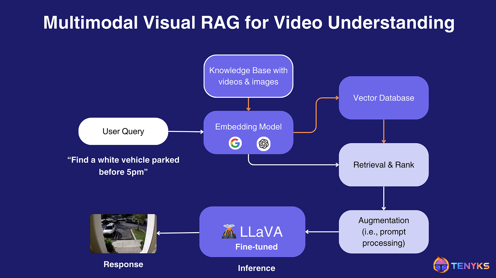
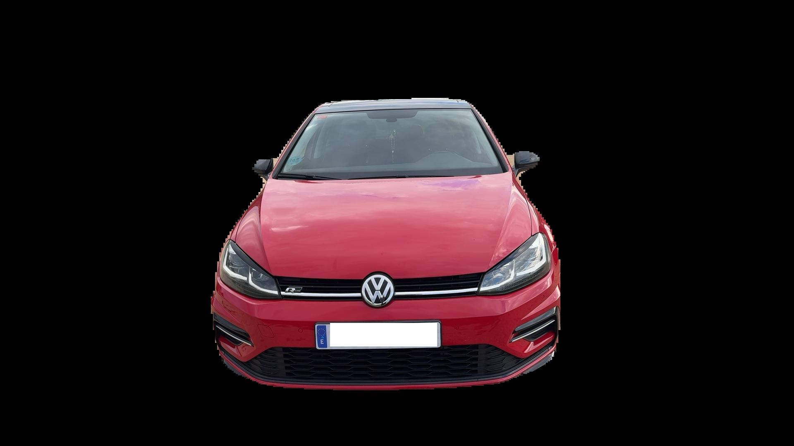
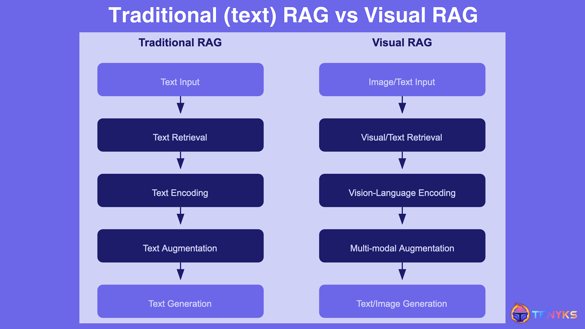

# <center>Retrieval-Augmented Generation Vision Engine 🔍 </center> 

<p align="center">
  
</p>

<p align="center">
  
  
  
  
  
  
</p>

---

# 📘 What Is RAG Vision Engine?

**RAG Vision Engine** is an experimental **retrieval-augmented computer vision system** combining:

- **CLIP ViT-B/32** → visual patch embedding and retrieval  
- **Qwen2-VL-2B-Instruct** → vision–language reasoning  
- A custom **RAG-style pipeline adapted for images**  
- **FastAPI** backend for inference  
- **Gradio** frontend for interactive usage  

It enables:

- 🏷️ **Semi-automatic dataset labeling**  
- 🧠 **Visual reasoning over retrieved evidence**  
- 🔍 **Few-shot classification using support sets**  
- 🖼️ **Patch-based similarity search**  
- 📊 **Explainable output with natural language**  

---

## 📸 RAG-Vision Summary Table

| Retrieval Evidence | Query Image | System Prompt | User Prompt | Result |
|-------------------|-------------|----------------|-------------|---------|
| <p align="center"></p> | <p align="center"></p> | *"You are a visual reasoning engine. Analyze the provided images and determine the condition of the object."* | *"Is the vehicle dirty or clean? Explain your reasoning briefly."* | **Flag:** Dirty<br>**Explanation:** "The vehicle surface appears stained and dusty compared to clean support examples."<br>**Class Scores:** `{dirty: 0.89, clean: 0.11}` |

---

# ✨ Key Features

### 🔹 Retrieval-Augmented Vision (CLIP)
- Extracts patches from support and query images  
- Computes per-patch CLIP embeddings  
- Retrieves the most semantically similar patches  
- Produces per-class similarity scores  

### 🔹 Vision-Language Reasoning (Qwen2-VL)
- Consumes both the query image and the retrieved patches  
- Uses system + user prompts  
- Outputs:
  - Binary flag  
  - Explanation  
  - Raw VLM transcript  
  - Class similarity map  

### 🔹 Integrated Full Stack
- **FastAPI** for serving inference  
- **Gradio** for interactive UI  
- Both run inside a **single Docker container**  

---

# 🧠 Models Used

## 1. CLIP ViT-B/32  
**Task:** Patch-based embedding + retrieval  
- Converts each image into a grid of embeddings  
- Computes cosine similarity to support patches  
- Provides evidence for Qwen2-VL  

## 2. Qwen2-VL-2B-Instruct  
**Task:** Multimodal reasoning  
- Accepts multiple images  
- Accepts system/user prompts  
- Generates explanations and classifications  

---

## 🔍 Difference Between Traditional Text RAG and Vision RAG

Traditional **text-based RAG** retrieves relevant text passages (documents, sentences, embeddings) and feeds them to a language model alongside the user query. The model then generates an answer grounded in textual evidence.

**Vision RAG**, on the other hand, retrieves visual evidence. The system extracts image patches from a support dataset using CLIP, embeds them, and retrieves the most similar patches to the query image. These retrieved visual examples — together with system and user prompts — are then passed to a Vision-Language Model (e.g., Qwen2-VL) to generate a classification flag, explanation, and reasoning.

In short: **text RAG retrieves text, while Vision RAG retrieves images**.  
Both follow the same “retrieve → reason” philosophy, but Vision RAG applies it to the visual domain using multimodal models.

<p align="center">
  
</p>

---

# 📦 Project Structure

```text
rag-vision-engine
├── assets
│   ├── diagram.jpg
│   ├── dirty.jpg
│   └── clean.jpg
├── backend
│   ├── api
│   │   ├── routers
│   │   │   └── api_settings.py
│   │   ├── routers
│   │   │   ├── api_v1
│   │   │   │   ├── healthcheck_ragvision.py
│   │   │   │   ├── rag_vision_router.py
│   │   │   │   └── support_upload_router.py
│   │   │   ├── events
│   │   │   │   └── logging.py
│   │   │   └── api.py
│   │   ├── schema
│   │   │   ├── ragvision_inputs.py
│   │   │   ├── ragvision_outputs.py
│   │   │   └── support_upload_input.py
│   │   ├── services
│   │   │   ├── inference.py
│   │   │   ├── main.py
│   │   │   ├── postprocessor.py
│   │   │   ├── preprocessor.py
│   │   │   └── support_index.py
│   │   ├── utils
│   │   │   ├── base_model_clip.py
│   │   │   ├── base_model_qwen_vl_2b.py
│   │   │   ├── image_utils.py
│   │   │   └── properties.py
│   │   └── app.py
│   ├── artifacts
│   │   ├── clip_vit_base_patch32
│   │   └── qwen2_vl_2b_instruct
│   ├── data
│   │   └── support
│   ├── docs
│   │   └── openapi.json
│   ├── notebooks
│   │   ├── clip_local_setup.ipynb
│   │   ├── qwen2_vl_2b_instruct_setup.ipynb
│   │   └── vehicle_dirty_test_with_local_models.ipynb
│   ├── test
│   │   └── pytest
├── frontend/
│   ├── assets
│   │   ├── examples
│   │   │   ├── prompts
│   │   │   │   └── prompts.py
│   │   │   ├── query_image
│   │   │   │   └── query.jpg
│   │   │   ├── support
│   │   │   │   ├── clean
│   │   │   │   │   ├── clean_1.jpg
│   │   │   │   │   ├── clean_2.jpg
│   │   │   │   │   └── clean_2.jpg
│   │   │   │   └── dirty
│   │   │   │       ├── dirty_1.jpg
│   │   │   │       ├── dirty_2.jpg
│   │   │   │       └── dirty_3.jpg
│   │   │   └── example_payload.py
│   │   └── logos
│   │       └── logo.jpg
│   ├── config
│   │   └── properties.py
│   ├── services
│   │   └── properties.py
│   ├── ui
│   │   └── layout.py
│   ├── utils
│   │   ├── image_utils.py
│   │   └── text_utils.py
│   └── app.py
├── .gitignore
├── app.py
├── Dockerfile
├── LICENSE
├── README.md
├── requirements.txt
├── run_all.sh
├── run_api.sh
└── space.yaml
```

---

# 🚀 Running the Project (Docker)

Build the container:

```bash
docker build -t rag-vision .

```
Run
```bash
docker run -p 7860:7860 rag-vision
```

Open:
http://localhost:7860

---

# 🧩 Running Locally (Without Docker)

Install dependencies:

```bash
pip install -r requirements.txt
```

```bash
pip install -r requirements.txt
```

Run the unified app:

```bash
python app.py
```

Backend (FastAPI) and frontend (Gradio) start together.

---

# 🔧 API Endpoints

## POST /api/ragvision/invocations

Runs the full RAG-Vision inference pipeline.

## POST /api/support/upload/image

Uploads a single image belonging to a support class.

## GET /api/ragvision/healthcheck

Basic backend healthcheck.

---

# 📁 Example Programmatic Usage
```bash
from frontend.services.rag_api_client import run_rag_inference

result = run_rag_inference(
    system_prompt="Classify the vehicle.",
    user_prompt="Is it dirty or clean?",
    encoded_image=encoded_b64,
    temperature=0.2,
    top_p=0.95,
    k_retrieval=4,
    max_patches_per_class=3,
    max_new_tokens=200,
    input_resolution=224,
    support_res=224,
    support_patch_size=32,
)
```

---

# 📘 Configuration Files Explained
Configures:
- Python version
- CPU/GPU resources
- Timeouts
- Container behavior

requirements.txt

Pinned versions of:
- FastAPI
- Gradio
- Torch
- Transformers
- CLIP
- NumPy
- Pillow

---

# 📄 Full API Specification 
You can find the full OpenAPI schema here:  
➡️ [`backend/docs/openapi.json`](backend/docs/openapi.json)

---

# 🔐 License

This project is distributed under the MIT License, allowing reuse and modification.

---

# 👤 Author

Raul Artigues Femenia
- 🌐 Website: https://www.raulartigues.com
- 🐙 GitHub: https://github.com/raulartigues

---

# ⭐ Support This Project

If you find this project useful:
- Star ⭐ the GitHub repo
- Fork and experiment
- Submit issues or PRs

---